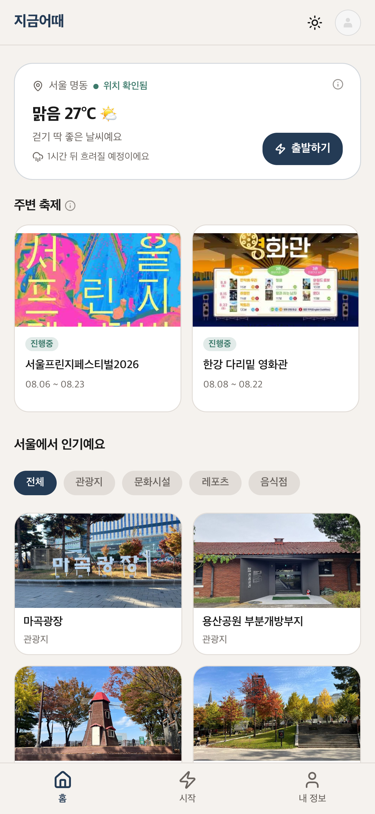
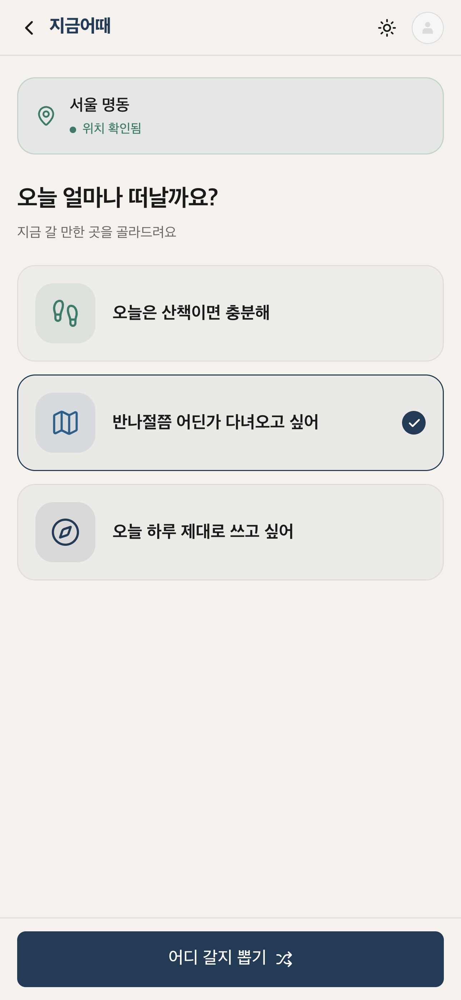
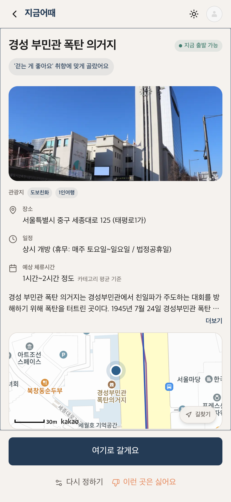
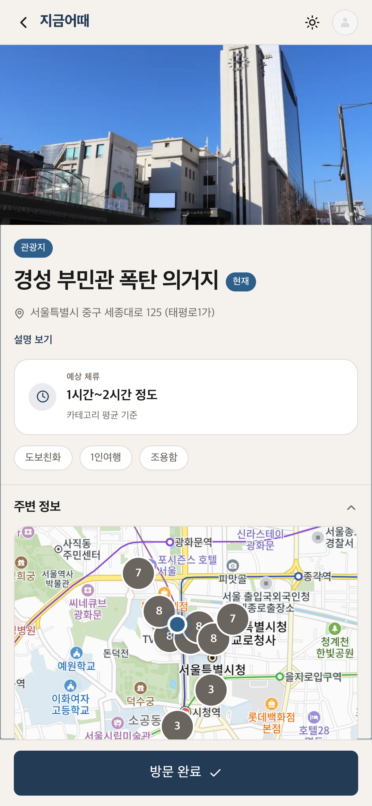
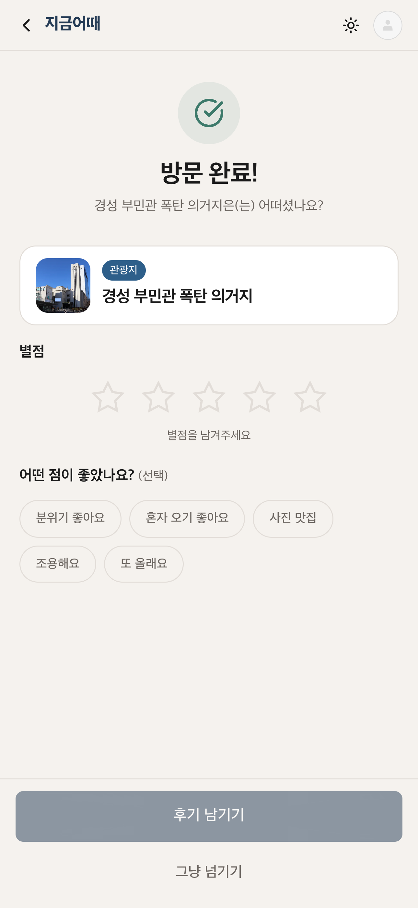
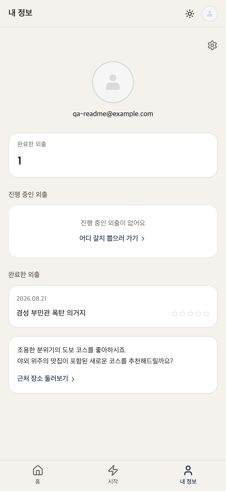
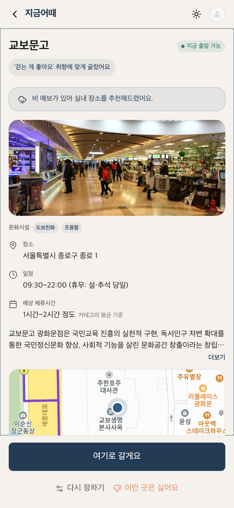

# 지금어때 (Instant-Trip)

지금 갈 만한 곳을 딱 한 군데 정해주는 즉흥 외출 서비스. 위치와 외출 규모만 선택하면, 지금 문을 연 곳 중 취향에 맞는 장소 하나를 골라줍니다.

> "여행을 위해 시간을 내는 것이 아니라, 시간이 나는 순간 바로 나갈 수 있도록"

🔗 **배포 링크**: [instant-trip.vercel.app](https://instant-trip.vercel.app)

## 🎯 서비스 개요

기존 여행 플래너 서비스는 많은 정보를 제공하지만, 오히려 선택지가 많아질수록 즉흥적으로 나서는 재미는 퇴색됩니다. **지금어때**는 결정을 줄이고 실행을 늘리는 것을 핵심 철학으로 삼습니다.

- **현재 위치 기반** 주변 관광지 자동 수집
- **요일별 운영시간을 해석**해 지금 영업 중인 곳만 실시간 필터링
- **오늘 열리는 축제·행사**도 함께 조회해 홈 화면에서 확인
- **단 하나의 장소**만 제시 — 비교 과정 제거
- **거절 기반 재추천** — 싫은 이유를 선택하면 즉시 재생성 (최대 3회)
- **홈 화면 인기 장소·주변 축제를 직접 선택**해 취향 추천 절차 없이 바로 코스 생성

## 🛠 기술 스택

| 역할             | 기술                                        |
| ---------------- | ------------------------------------------- |
| 프레임워크       | Next.js 16 (App Router, RSC)                |
| 언어             | TypeScript 5                                |
| 스타일링         | Tailwind CSS 4                              |
| 컴포넌트         | Shadcn/ui + Base UI                         |
| 아이콘           | lucide-react                                |
| 서버 상태        | TanStack Query 5                            |
| 클라이언트 상태  | Zustand 5                                   |
| 폼 & 유효성 검사 | React Hook Form 7 + Zod 4                   |
| 인증             | better-auth + emailOTP 플러그인             |
| 이메일 발송      | Resend                                      |
| 데이터베이스     | Neon (PostgreSQL) + Drizzle ORM             |
| 지도             | Kakao Maps SDK + react-kakao-maps-sdk       |
| 바텀시트/드로어  | vaul                                        |
| OTP 입력         | input-otp                                   |
| 페이지 전환 로딩 | nextjs-toploader                            |
| 테스트           | Vitest + Testing Library + MSW              |
| 배포             | Vercel                                      |

## 🗺 핵심 API

### 한국관광공사 TourAPI 4.4

| API                | 용도                                                |
| ------------------ | --------------------------------------------------- |
| locationBasedList2 | GPS 좌표 + 반경 기반 주변 관광지 수집 (추천 파이프라인) |
| areaBasedList2     | 홈 화면 근처 장소 수집                               |
| detailIntro2       | 운영시간(usetime)·휴무일(restdate) 요일 인지 판정    |
| detailCommon2      | 관광지 기본 정보 (명칭, 주소, 좌표)                  |
| detailImage2       | 장소 카드 썸네일 이미지                              |
| searchFestival2    | 오늘 날짜 기준 진행 중인 축제·행사 조회              |

### 외부 API

| API                          | 용도                                                     |
| ----------------------------- | -------------------------------------------------------- |
| 공공데이터포털 문화축제 API   | 축제 데이터 소스 — searchFestival2와 병합해 홈 화면에 표시 |
| Kakao Local API               | 후보 부족 시 공원 보충, 외출 진행 중 근처 카페·식당·약국·주차장 검색 |
| Kakao 지도 JS SDK (Map)       | 외출 추천 결과 화면의 장소 지도 미리보기                 |
| Kakao 지도 JS SDK (Places)    | 근처 맛집 섹션 (음식 선호 취향 선택 시)                  |
| 국토교통부 브이월드 지오코더  | 위치 권한 승인 시 좌표 → 주소 역지오코딩                 |
| 기상청 단기예보 조회서비스 (getUltraSrtNcst·getUltraSrtFcst) | 홈 화면 현재 날씨 표시(초단기실황) + 홈·코스 진행 화면 날씨 변화 예보 안내(초단기예보) |

### 데이터 출처 표시

공공데이터포털 이용약관상 저작자표시(공공누리 제1유형)가 걸려 있는 API는 아래 2개뿐입니다 — 화면 디자인을 해치지 않도록 상시 노출 문구 대신, 데이터가 실제 쓰이는 지점에 작은 안내 아이콘(`AttributionNotice`)을 달아 탭했을 때만 출처를 보여줍니다.

| 엔드포인트 | 제공기관 | 표시 위치 |
| --- | --- | --- |
| `VilageFcstInfoService_2.0` (기상청 단기예보 조회서비스) | 기상청 | 홈 화면 날씨 카드 |
| `tn_pubr_public_cltur_fstvl_api` (전국문화축제표준데이터) | 문화체육관광부·한국관광공사 | 홈 화면 "주변 축제" 섹션 |

## 📱 화면 구조

```
/sign-in              이메일 입력 (회원가입/로그인 통합)
/sign-in/verify       OTP 6자리 코드 입력
/onboarding           최초 1회 yes/no 성향 질문 (5문항)
/onboarding/done      성향 요약 확인
/                     홈 (위치 기반 근처 장소·축제, 카드를 직접 탭해 바로 코스 생성 가능)
/start                위치 확인 + 외출 규모 선택
/course/preview       외출 추천/선택 결과 (지도 미리보기 + 인라인 거절 패널)
/course/active/[id]   외출 진행 중 (장소 체크리스트 + 주변 정보 펼치기 섹션)
/course/done/[id]     외출 완료 + 별점 후기
/profile              내 정보 + 완료 기록 목록
/settings             성향 재설정
```

## 📂 디렉토리 구조

```
├── app/              # Next.js App Router (라우트, 레이아웃, Server Actions)
├── client/           # 브라우저 전용 (hooks, Zustand stores, providers)
├── server/           # 백엔드 전용 (auth, DB, schema, session, weather)
├── shared/           # 공용 코드 (types, constants, schemas, utils)
├── components/
│   ├── commons/      # 도메인 무관 UI 컴포넌트 (Button, Card, …)
│   └── domains/      # 기능별 컴포넌트 (auth, course, home, location, onboarding, profile, settings, start)
└── lib/
    ├── pipeline/     # 외출 추천 파이프라인
    ├── tour/         # TourAPI 클라이언트 + 매퍼
    ├── clients/      # 외부 API 클라이언트 (Kakao, 문화축제)
    ├── home/         # 홈 화면 데이터 조회 (장소·축제 병렬 조회)
    └── cache/        # DB 기반 캐시 (TTL 관리)
```

## 🎨 디자인 시스템

"결정을 줄이고 실행을 늘린다"는 철학을 인터페이스 전체에 적용합니다.

### 컬러 팔레트

| 역할           | 라이트    | 다크      |
| -------------- | --------- | --------- |
| Primary        | `#243B55` | `#5B8DB8` |
| Secondary      | `#2E5F8A` | `#4A7AA8` |
| Accent (그린)  | `#3D7A6B` | `#52A88E` |
| Point (오렌지) | `#E8936A` | `#F0A882` |
| Background     | `#F5F2EE` | `#0F1923` |
| Surface        | `#FFFFFF` | `#1A2A38` |
| Border         | `#E2DDD8` | `#2A3F52` |
| Text Primary   | `#1A1A1A` | `#F0EDE8` |
| Text Secondary | `#6B6560` | `#9AADA8` |

### 컬러 역할

- **Primary** — CTA 버튼, 주요 인터랙션
- **Secondary** — 카테고리 배지, "진행 중"/"현재" 상태 표시
- **Accent** — 영업중(지금 출발 가능) 배지, 위치 확인 등 긍정 상태
- **Point** — 오늘 축제 배지, 이벤트 강조

## 🔐 인증 플로우

별도 회원가입 페이지 없이 `/sign-in` 단일 페이지에서 처리합니다. better-auth의 emailOTP 플러그인이 신규 사용자는 자동 계정 생성, 기존 사용자는 로그인을 처리합니다.

```
이메일 입력 → 6자리 OTP 코드 발송 (Resend) → 코드 입력 → 세션 생성
```

## 🧠 외출 추천 파이프라인

`/start`에서 외출 규모를 선택했을 때만 도는 파이프라인입니다. 가용성 검사(영업 여부 확인)를 먼저 몰아서 하지 않고, **점수화를 끝낸 뒤 점수 순으로 하나씩만 확인해 최초로 열려 있는 곳을 채택**하는 구조입니다 — 전체 후보를 미리 다 검사하는 것보다 외부 API 호출량이 훨씬 적습니다.

```
1. 후보지 수집
   GPS 좌표 + 반경 내 관광지 목록 조회 (외출 규모별 5~20km)

2. Kakao 보충
   후보가 적은 경우(가볍게 규모 한정) 공원 키워드로 보충

3. 태그 기반 점수화
   온보딩 성향 태그 × 관광지 태그 매핑으로 적합도 산출, 거절 이력 실시간 반영

4. 가용성 게이트
   점수 순으로 하나씩 요일별 운영시간·입장마감·예상 체류시간을 확인해
   최초로 "지금 갈 수 있는" 곳을 채택 (판정이 불확실하면 보수적으로 통과)

5. 상세 조회
   채택된 후보의 상세 정보와 썸네일을 조회해 결과 화면 구성
```

홈 화면 "인기 장소"·"주변 축제" 카드를 직접 탭하는 경우(위 화면 구조의 `/` 참조)는 이 파이프라인의 수집·점수화·가용성 검사 단계를 모두 건너뛰고, 선택한 장소/축제 하나를 곧바로 코스로 만듭니다 — 추천 절차 없이 바로 시작하고 싶은 사용자를 위한 의도적인 지름길입니다.

축제·행사 목록 자체는 이 파이프라인의 점수화에 관여하지 않습니다 — searchFestival2와 공공데이터포털 문화축제 API를 병렬로 조회해 홈 화면에 별도로 표시합니다.

## 📸 스크린샷

| 화면 | 스크린샷 | 화면 | 스크린샷 |
| --- | --- | --- | --- |
| **온보딩 화면** (`OnboardingForm`)<br>yes/no 성향 질문 UI |  | **홈 화면** (`HomeView`)<br>위치 기반 근처 장소·축제, 날씨 표시 |  |
| **출발 설정 화면** (`StartView`)<br>외출 규모 선택 |  | **코스 추천 화면** (`CourseResultView`)<br>지도 미리보기 + 거절 재추천 패널 |  |
| **코스 진행 화면** (`CourseActiveView`)<br>장소 체크리스트 + 주변 정보 펼치기 섹션 |  | **코스 완료 화면** (`CourseDoneView`)<br>별점 후기 |  |
| **프로필 화면** (`ProfileView`)<br>완료 기록 목록 |  | **날씨 전환 안내 배너** (코스 추천 화면)<br>실외 후보 감점으로 실내 장소가 채택되면 사유 노출 |  |

## 🚀 시작하기

```bash
# 의존성 설치
pnpm install

# DB 마이그레이션
pnpm db:push

# 개발 서버 실행
pnpm dev
```

DB(Neon)·인증(better-auth)·TourAPI·Kakao 등 외부 서비스 연동에 필요한 환경 변수 설정이 선행되어야 합니다. 브라우저에서 [http://localhost:3000](http://localhost:3000)에 접속하여 확인할 수 있습니다.

## 🧪 테스트 · CI/CD

- `pnpm test`(vitest run) — 30개 파일, 223개 테스트 전부 통과
- `pnpm type-check`(tsc --noEmit) — 에러 0건
- `pnpm lint`(eslint) — 에러 0건
- CI(`.github/workflows/ci.yml`) — PR 시 lint → type-check → test → build 순으로 검증
- 배포(`.github/workflows/deploy.yml`) — main 브랜치 push 시 CI 통과를 전제로 `vercel build --prod` → `vercel deploy --prebuilt --prod`(prebuilt 배포)
- 크론(`vercel.json`) — `/api/cron/warm-festivals`를 매일 UTC 15:00(KST 00:00)에 호출해 축제 캐시를 예열

## 🌱 개발 로드맵

### 1순위 (MVP) — 완료

- [x] 프로젝트 초기 설정 및 아키텍처 구성
- [x] better-auth + emailOTP 인증 (이메일 → OTP → 세션)
- [x] 온보딩 5문항 성향 파악 + 태그 가중치 변환
- [x] TourAPI 연동 및 5단계 외출 추천 파이프라인
- [x] 요일 인지 실시간 운영시간 판정 (detailIntro2)
- [x] 축제·행사 조회 및 홈 화면 표시 (searchFestival2 + 공공데이터포털)
- [x] 외출 추천 결과 화면 + 거절 재추천 (최대 3회)
- [x] 외출 진행 화면 (체크리스트 + 주변 POI)
- [x] 외출 완료 화면 (별점 후기)

### 2순위 — 완료

- [x] 태그 가중치 개인화 (온보딩 답변 기반)
- [x] 별점 후기
- [x] 프로필 페이지 (완료 기록 목록)
- [x] Kakao Maps 지도 연동
- [x] Kakao Local API 주변 POI 검색
- [x] 다크 모드
- [x] 날씨 예보 안내 (초단기예보 기반, 홈·코스 진행 화면) + 공공데이터 출처 표시

### 3순위 — 예정

- [ ] 날씨 예보 기반 실내/실외 추천 가중치 조정
- [ ] 애완동물 동반 장소 추천 및 온보딩 항목 추가
- [ ] 다국어 지원

---

본 프로젝트는 **2026 관광데이터 활용 공모전 - ① 웹·앱 개발 부문** 출품작입니다.
